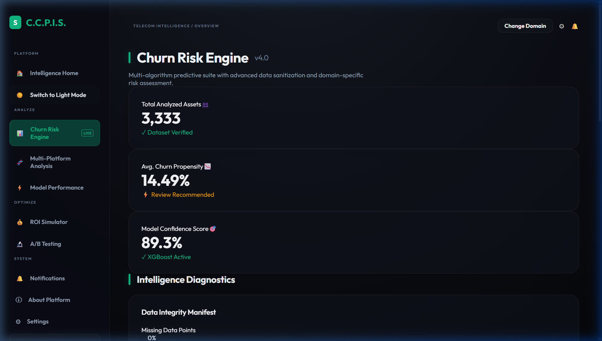
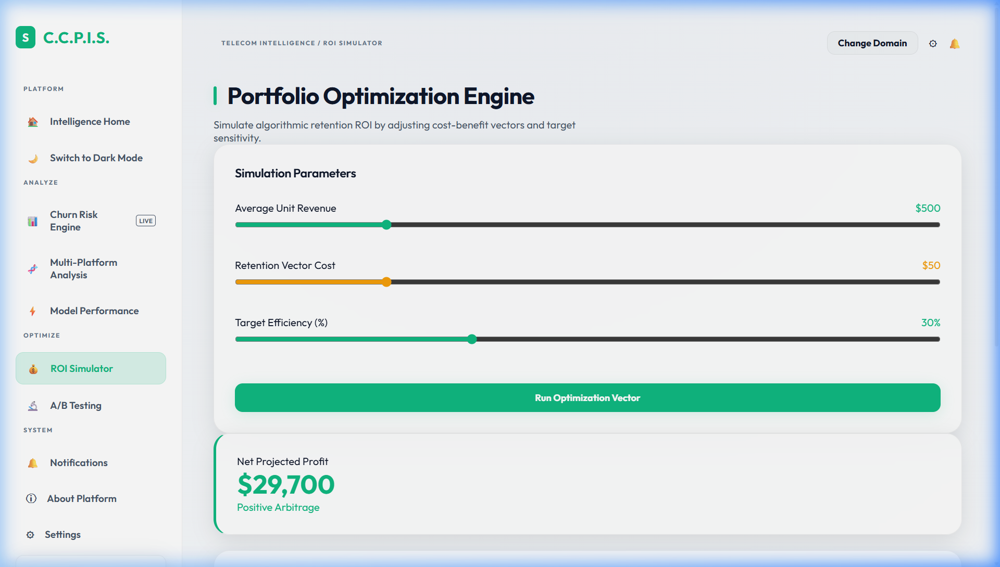
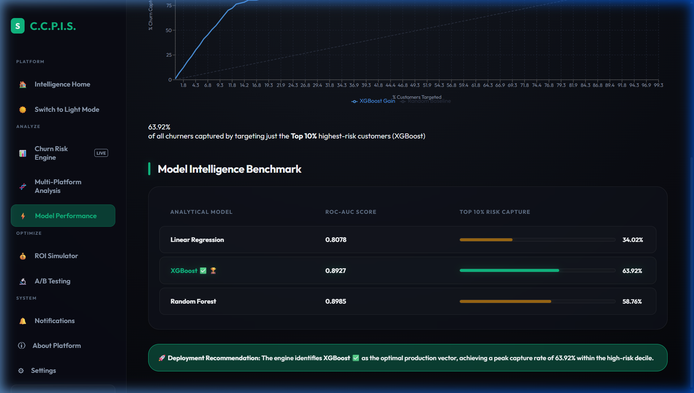
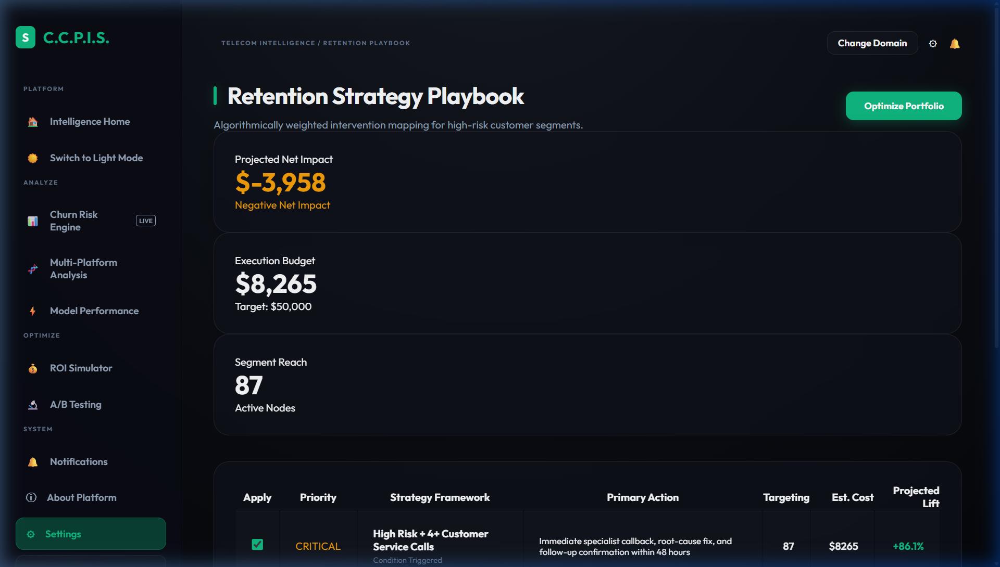
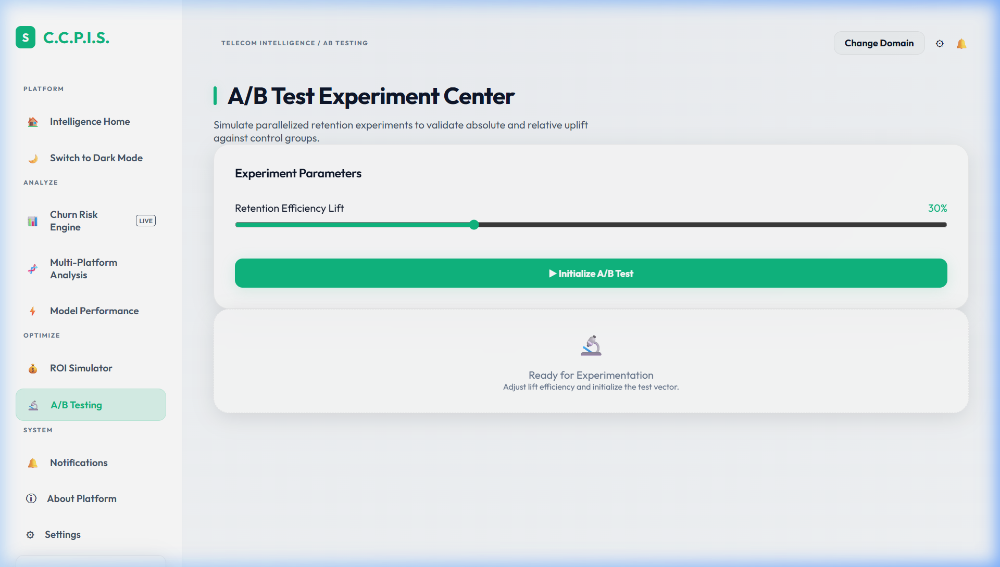

# Customer Churn Prediction Intelligence System (C.C.P.I.S.)

<div align="center">


**A premium, full-stack AI platform for predicting and preventing customer churn across Telecom, Banking, and E-Commerce domains.**

</div>

---

## Preview

### Intelligence Home


### Churn Risk Engine (Dark Mode)


### ROI Simulator (Light Mode)


### Model Intelligence Benchmark


### Retention Strategy Playbook


### A/B Testing Center


---

## Features

| Module | Description |
|---|---|
| **Churn Risk Engine** | Real-time XGBoost churn probability scoring, class distribution, data integrity manifest |
| **High-Risk Ranking** | Filterable customer segment table with geography and revenue filters |
| **Multi-Platform Analysis** | Feature importance across Telecom, Banking, and E-Commerce domains |
| **Model Performance** | ROC-AUC curves, cumulative gain charts, model benchmark table |
| **Retention Playbook** | Strategy cards with projected ROI per customer category |
| **ROI Simulator** | Adjustable intervention sliders with revenue recovery projections |
| **A/B Testing** | Statistical significance testing for retention interventions |
| **Reward System** | Campaign builder for loyal user rewards and at-risk re-engagement |
| **3 Themes** | Dark · Light · AMOLED pitch-black (OLED optimized) |
| **File Upload** | Real CSV/JSON/XLSX drag-and-drop ingest with validation |

---

## Getting Started

### Prerequisites
- Node.js 18+
- Python 3.9+

### Frontend
```bash
cd frontend
npm install
npm run dev
# → http://localhost:3000
```

### Backend
```bash
pip install -r requirements.txt
python -m uvicorn backend.main:app --reload --port 8000 --app-dir .
# → http://localhost:8000
```

---

## Tech Stack

**Frontend:** React 18 · Vite · Recharts · Lucide Icons · Custom Glassmorphism CSS

**Backend:** FastAPI · XGBoost · scikit-learn · pandas · NumPy · Uvicorn

**ML Models:** XGBoost (primary) · Random Forest · Logistic Regression

---

## Supported Domains

- **Telecom** — churn from call patterns, data usage, international plans
- **Banking** — at-risk account holders via balance, activity & support signals
- **E-Commerce** — churning shoppers from order history & satisfaction scores

---

## Project Structure

```
hack temp/
├── frontend/
│   ├── src/
│   │   ├── pages/           # All page components
│   │   ├── App.jsx          # Main app with routing & theme engine
│   │   ├── api.js           # Backend API client
│   │   └── index.css        # Glassmorphic design system
│   └── index.html
├── backend/
│   └── main.py              # FastAPI server & ML pipeline
├── preview/                 # App screenshots
└── requirements.txt
```

---

<div align="center">

Built for the Hackathon &nbsp;·&nbsp; **C.C.P.I.S. v4.0**

</div>
